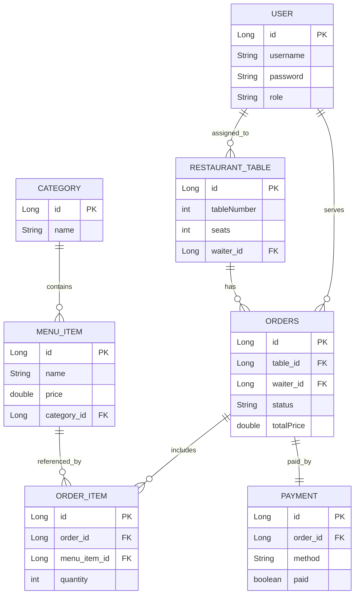

# Restaurant App

Restaurant App is a full-stack restaurant management application developed using Spring Boot and React.

The application allows restaurant staff to manage:

* users and roles;
* menu categories;
* menu items;
* restaurant tables;
* orders;
* order items;
* payments.

The project includes a React frontend, a Spring Boot backend, database persistence, testing, CI/CD pipeline, monitoring, microservice infrastructure and AI-assisted features.

---

# Project Description

The main purpose of the application is to manage restaurant operations in a simple and organized way.

The system supports role-based access:

* ADMIN and MANAGER can access all functionalities;
* WAITER can create orders, add products to orders and manage payments;
* BARTENDER can view orders and order items.

Tables can be assigned to waiters, and waiters can see only the orders related to their assigned tables.

---

# Architecture

The application started as a Spring Boot monolithic application and was later extended with microservice-related components.

Main components:

* React + TypeScript Frontend
* Spring Boot Backend
* PostgreSQL Database
* H2 Test Database
* API Gateway
* Eureka Server
* Config Server
* User Service
* Reporting Service
* Redis
* Prometheus
* Grafana
* GitHub Actions CI/CD

General flow:

```text
Browser / React Frontend
        |
        v
API Gateway / Spring Boot API
        |
        v
Backend Services
        |
        v
Database
```

---

# ER Diagram

The diagram below documents the current entity relationships used in this project.

## Mermaid Plugin (IntelliJ)

To render Mermaid diagrams directly in IntelliJ IDEA Community Edition:

1. Open `Settings` (`File -> Settings` on Windows/Linux).
2. Go to `Plugins -> Marketplace`.
3. Search for `Mermaid` and install a Mermaid preview plugin.
4. Restart IntelliJ.
5. Open `README.md` and use Markdown preview to view the ER diagram.

If your plugin supports it, enable options like `Auto-render` or `Render on save` for smoother editing.



## Notes

* `Order` is mapped to table name `orders` in code.
* `Payment` is a one-to-one relation with `Order`.
* `OrderItem` acts as the line-item bridge between `Order` and `MenuItem`.

---

# Main Features

## Users and Roles

* user creation;
* role management;
* login;
* role-based access control.

## Menu Management

* categories CRUD;
* menu items CRUD;
* product price management.

## Restaurant Tables

* table CRUD;
* assigning waiters to tables.

## Orders

* create orders;
* assign waiter and table;
* add menu items to an order;
* automatic total price calculation;
* order status management.

## Payments

* payment creation;
* CASH / CARD payment method;
* paid / unpaid status;
* automatic update of order status.

## AI Recommendations

The application includes an AI Runtime module that generates recommendations based on menu data.

Endpoint:

```http
GET /api/ai/recommendations
```

---

# Frontend

A React + TypeScript frontend is available in:

```text
frontend/
```

The frontend consumes backend endpoints under `/api/*`.

Technologies used:

* React
* TypeScript
* Vite
* React Router
* React Select
* custom CSS UI

Frontend URL:

```text
http://localhost:5173
```

---

# Backend

The backend is implemented using Spring Boot.

Technologies used:

* Java
* Spring Boot
* Spring Data JPA
* Spring Security
* Maven
* PostgreSQL
* H2 for tests

Backend URL:

```text
http://localhost:8080
```

---

# API Documentation

## Users

```http
GET    /api/users
GET    /api/users/{id}
POST   /api/users
PUT    /api/users/{id}
DELETE /api/users/{id}
```

## Categories

```http
GET    /api/categories
GET    /api/categories/{id}
POST   /api/categories
PUT    /api/categories/{id}
DELETE /api/categories/{id}
```

## Menu Items

```http
GET    /api/menu-items
GET    /api/menu-items/{id}
POST   /api/menu-items
PUT    /api/menu-items/{id}
DELETE /api/menu-items/{id}
```

## Restaurant Tables

```http
GET    /api/restaurant-tables
GET    /api/restaurant-tables/{id}
POST   /api/restaurant-tables
PUT    /api/restaurant-tables/{id}
DELETE /api/restaurant-tables/{id}
```

## Orders

```http
GET    /api/orders
GET    /api/orders/{id}
POST   /api/orders
PUT    /api/orders/{id}
DELETE /api/orders/{id}
```

## Order Items

```http
GET    /api/order-items
GET    /api/order-items/{id}
POST   /api/order-items
PUT    /api/order-items/{id}
DELETE /api/order-items/{id}
```

## Payments

```http
GET    /api/payments
GET    /api/payments/{id}
POST   /api/payments
PUT    /api/payments/{id}
DELETE /api/payments/{id}
```

## AI Recommendations

```http
GET /api/ai/recommendations
```

---

# Complete Setup Guide

## Status

* Backend running on port 8080
* Frontend running on port 5173
* CRUD operations implemented
* Role-based access implemented
* Testing implemented
* CI/CD configured
* Monitoring configured
* AI Recommendations implemented

---

# How to Start Locally

## Terminal 1 - Backend

```powershell
cd C:\Users\Admin\Desktop\restaurantapp
.\mvnw.cmd spring-boot:run
```

## Terminal 2 - Frontend

```powershell
cd C:\Users\Admin\Desktop\restaurantapp\frontend
npm install
npm run dev
```

## Browser

Open:

```text
http://localhost:5173
```

---

# Local Development Flow

```text
┌─────────────────────────────────────────────────────────┐
│ Browser: http://localhost:5173                          │
│ React app with Vite dev server                          │
└──────────────────┬──────────────────────────────────────┘
                   │
        ┌──────────▼──────────┐
        │   Vite Proxy        │
        │   regex: ^/api      │
        │   ↓                 │
        │ http://localhost:8080
        │
┌──────────────────▼──────────────────────────────────────┐
│ Spring Boot API: http://localhost:8080                  │
│ GET /api/categories                                     │
│ POST /api/categories                                    │
│ PUT /api/categories/{id}                                │
│ DELETE /api/categories/{id}                             │
└─────────────────────────────────────────────────────────┘
        │
        ▼
   Database
```

---

# Microservices Architecture

The optional microservices part was implemented using:

* Config Server
* Eureka Server
* API Gateway
* User Service
* Reporting Service
* Main Restaurant Service

## Config Server

Used for centralized configuration.

## Eureka Server

Used for service discovery.

## API Gateway

Used for centralized routing, request filtering and gateway access.

## User Service

Used for authentication and user-related responsibilities.

## Reporting Service

Used for reporting and inter-service communication demonstrations.

---

# Service Discovery

Eureka is used as a service registry.

Services register automatically in Eureka and can be discovered by name.

Eureka Dashboard:

```text
http://localhost:8761
```

---

# API Gateway

API Gateway provides:

* centralized routing;
* request filtering;
* response filtering;
* integration with service discovery.

Gateway URL:

```text
http://localhost:8085
```

---

# Load Balancing

Spring Cloud LoadBalancer was used to demonstrate multiple instances of a service.

The application can run multiple instances of the same service and route requests between them through service discovery.

---

# Monitoring

Monitoring was implemented using:

* Spring Boot Actuator
* Prometheus
* Grafana

Prometheus URL:

```text
http://localhost:9090
```

Grafana URL:

```text
http://localhost:3000
```

Metrics monitored:

* JVM memory
* CPU usage
* HTTP requests
* application health

---

# Testing

The project includes both unit tests and integration tests.

## Unit Tests

Technologies:

* JUnit 5
* Mockito

The service layer is tested with mocked repositories.

## Integration Tests

Technologies:

* Spring Boot Test
* MockMvc
* H2 Test Database

Integration scenarios:

* complete order creation flow;
* adding products to an order;
* deleting order items and recalculating totals;
* creating and updating payments;
* updating order status based on payments.

## Coverage

JaCoCo is used for code coverage.

Service layer coverage is above the required 70%.

Coverage report:

```text
target/site/jacoco/index.html
```

## Test Database Configuration

Tests run using the `test` profile and H2 in-memory database.

Example configuration:

```properties
spring.jpa.hibernate.ddl-auto=create-drop
spring.datasource.url=jdbc:h2:mem:testdb
spring.datasource.driverClassName=org.h2.Driver
spring.datasource.username=sa
spring.datasource.password=
```

---

# CI/CD Pipeline

GitHub Actions is used for CI/CD.

The pipeline includes:

* backend build;
* automated test execution;
* frontend build;
* Docker Compose build;
* staging deployment simulation.

The workflow runs automatically on push and pull requests.

---

# Docker Deployment

The project can be started using Docker Compose.

```powershell
docker compose up -d
```

Dockerized / infrastructure services:

* PostgreSQL
* Redis
* Prometheus
* Grafana
* backend containers
* frontend container

---

# Environment Variables

Environment-specific values are stored outside the source code whenever possible.

Examples:

* database URL;
* database username;
* database password;
* service ports;
* Redis configuration.

For tests, H2 is configured separately through the test profile.

---

# Design Pattern

## Strangler Fig Pattern

The project uses the Strangler Fig Pattern as a migration approach from a monolithic application to a microservice-based architecture.

The original Restaurant App was kept functional, while additional services were introduced gradually:

* User Service
* Reporting Service
* API Gateway
* Config Server
* Eureka Server

This allows the application to evolve gradually without rewriting the entire system at once.

Benefits:

* reduced migration risk;
* gradual extraction of responsibilities;
* independent service evolution;
* better scalability.

---

# NoSQL and Caching

Redis is used as a NoSQL / caching infrastructure component.

It is used in the project infrastructure for fast access and scalability-related features.

Benefits:

* faster access to frequently used data;
* reduced database load;
* improved scalability;
* support for infrastructure features such as rate limiting.

---

# AI Agents - Development

## GitHub Copilot for Pair Programming

GitHub Copilot was used during the development process as an AI-assisted programming tool.

It provided real-time code suggestions for backend and frontend implementation, helping reduce development time and improve productivity.

## Automated Code Review for Pull Requests

GitHub Copilot was also used for analyzing Pull Requests and suggesting improvements.

Examples:

* detecting duplicated code;
* suggesting method simplification;
* recommending best practices for Spring Boot and React;
* checking code consistency;
* identifying possible problems before merging.

## Automatic Documentation Generation

AI-based tools were used to generate and improve project documentation, including:

* microservices architecture explanation;
* testing documentation;
* CI/CD pipeline explanation;
* Docker and GitHub Actions configuration explanations.

## Benefits

* reduced development time;
* increased productivity;
* improved code quality;
* faster debugging;
* automated documentation support;
* support for code review and refactoring.

---

# AI Agents - Runtime

The application includes an AI Runtime feature through the AI Recommendations module.

Endpoint:

```http
GET /api/ai/recommendations
```

The module analyzes menu items and generates smart recommendations that can help restaurant staff promote specific products.

This feature demonstrates AI integration at runtime inside the application.

---

# Screenshots

Add screenshots for:

* login page;
* main dashboard;
* users page;
* orders page;
* payments page;
* AI recommendations page;
* Grafana dashboard;
* GitHub Actions pipeline.

Example format:

```markdown


```

---

# Team Members and Contributions

## 405 - BDTS
## Cimpeanu Ana-Maria
## Iova Nicoleta-Carmen
## Tismanaru Artemis-Constantina


Contributions:

* backend development;
* frontend development;
* database design;
* CRUD implementation;
* security and role-based access;
* testing;
* microservices setup;
* monitoring setup;
* CI/CD configuration;
* AI features;
* documentation.

---

# Implemented Requirements

## Mandatory Requirements

* Model de date
* CRUD operations
* Multi-environment configuration
* Testing
* Views and validation
* Logging
* Pagination and sorting
* Spring Security

## Optional Requirements

* Centralized configuration
* Service discovery
* Load balancing
* API Gateway
* Monitoring
* Resilience
* Design patterns

## Bonus

* AI in development
* AI runtime integration
* CI/CD pipeline
* Docker deployment

---

# Conclusion

Restaurant App is a full-stack restaurant management system built with enterprise technologies.

The project includes backend, frontend, database persistence, role-based access, tests, monitoring, microservice infrastructure, CI/CD automation, AI-assisted development and runtime AI recommendations.
