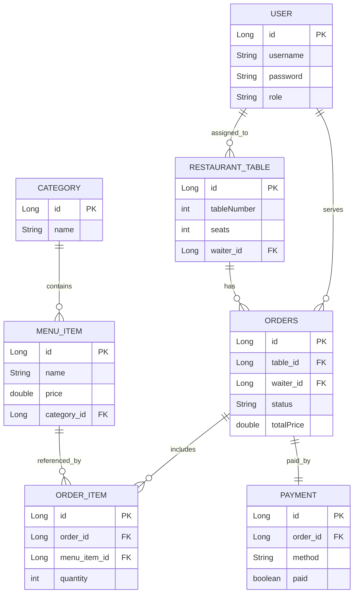

# Restaurant App

## ER Diagram

The diagram below documents the current entity relationships used in this project.

## Mermaid Plugin (IntelliJ)

To render Mermaid diagrams directly in IntelliJ IDEA Community Edition:

1. Open `Settings` (`File -> Settings` on Windows/Linux).
2. Go to `Plugins -> Marketplace`.
3. Search for `Mermaid` and install a Mermaid preview plugin.
4. Restart IntelliJ.
5. Open `README.md` and use Markdown preview to view the ER diagram.

If your plugin supports it, enable options like `Auto-render` or `Render on save` for smoother editing.

## Notes

- `Order` is mapped to table name `orders` in code.
- `Payment` is a one-to-one relation with `Order`.
- `OrderItem` acts as the line-item bridge between `Order` and `MenuItem`.
