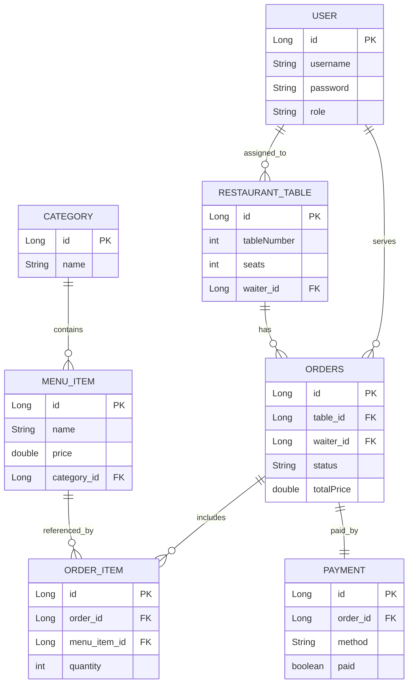

# Restaurant App

## ER Diagram

The diagram below documents the current entity relationships used in this project.

## Mermaid Plugin (IntelliJ)

To render Mermaid diagrams directly in IntelliJ IDEA Community Edition:

1. Open `Settings` (`File -> Settings` on Windows/Linux).
2. Go to `Plugins -> Marketplace`.
3. Search for `Mermaid` and install a Mermaid preview plugin.
4. Restart IntelliJ.
5. Open `README.md` and use Markdown preview to view the ER diagram.

If your plugin supports it, enable options like `Auto-render` or `Render on save` for smoother editing.



## Notes

- `Order` is mapped to table name `orders` in code.
- `Payment` is a one-to-one relation with `Order`.
- `OrderItem` acts as the line-item bridge between `Order` and `MenuItem`.

## Frontend (React)

A React + TypeScript frontend is available in `frontend/` and consumes backend endpoints under `/api/*`.

### Start backend

```powershell
cd C:\Users\Admin\Desktop\restaurantapp
.\mvnw.cmd spring-boot:run
```

### Start frontend

```powershell
cd C:\Users\Admin\Desktop\restaurantapp\frontend
npm install
npm run dev
```

Open `http://localhost:5173`.

# Restaurant App - Complete Setup Guide

## Status ✓ Functional

- ✓ Backend (Spring Boot) running on port 8080
- ✓ Frontend (React + Vite) running on port 5173
- ✓ Vite proxy correctly forwarding `/api` requests to backend
- ✓ CRUD operations working (tested with POST/GET)

## What You Have

### Backend
- 7 REST API endpoints for all entities (users, categories, menu-items, restaurant-tables, orders, order-items, payments)
- Full CRUD (Create, Read, Update, Delete) with proper HTTP verbs
- Server-side validation with `@Valid` and `@NotNull` annotations
- Global exception handler for errors
- CORS enabled for localhost:5173

### Frontend  
- React + TypeScript + Vite (dev server on 5173)
- Route-based CRUD forms for all entities
- Client-side form validation with user-friendly error messages in Romanian
- Custom 404 and 500 error pages
- API client with robust error handling for HTML responses

## How to Use

### Terminal 1 - Backend
```powershell
cd C:\Users\Admin\Desktop\restaurantapp
.\mvnw.cmd spring-boot:run
```

### Terminal 2 - Frontend
```powershell
cd C:\Users\Admin\Desktop\restaurantapp\frontend
npm run dev
```

### Then open browser
Visit **http://localhost:5173**

You should see the sidebar with entity names. Click on any entity (e.g., "Categories") and you'll see:
- A form to create/update records
- An ID field to fetch, update, or delete
- Buttons for Read All, Read by ID, Create, Update, Delete
- A results panel showing all records

## Verification Commands (PowerShell)

### Check Backend
```powershell
Invoke-WebRequest -Uri "http://localhost:8080/api/categories" -UseBasicParsing
```
Expected: `[{"id":1,"name":"Desserts"}]` (or empty `[]` if no data)

### Check Vite Proxy
```powershell
Invoke-WebRequest -Uri "http://localhost:5173/api/categories" -UseBasicParsing
```
Expected: Same as above (proxied through Vite)

### Create a Category
```powershell
$body = @{name="Appetizers"} | ConvertTo-Json
Invoke-WebRequest -Uri "http://localhost:5173/api/categories" -Method POST -Headers @{"Content-Type"="application/json"} -Body $body -UseBasicParsing
```
Expected: Status 201 with `{"id":2,"name":"Appetizers"}`

## Troubleshooting

### "Unexpected token '<'" Error in Browser
**Cause**: Browser is still showing cached old version before Vite proxy was fixed.  
**Solution**: Hard refresh your browser (Ctrl+F5 or Cmd+Shift+R on Mac)

### "Nu ma pot conecta la backend"
**Cause**: Backend is not running or port 8080 is in use.  
**Solution**: 
```powershell
netstat -ano | findstr "8080"
```
If no output, start backend. If something else uses 8080, change it in `application.properties`.

### Form shows validation errors even though data looks correct
**Cause**: Client-side validation is stricter than you thought.  
**Solution**: Check the error message - it tells you exactly what's wrong (e.g., "Price trebuie sa fie >= 0.01")

### POST succeeds but "Read All" shows 0 items
**Cause**: Browser might be showing stale data or need refresh.  
**Solution**: Click "Read All" button again, or refresh page (F5)

## Architecture Overview

```
┌─────────────────────────────────────────────────────────┐
│ Browser: http://localhost:5173                          │
│ (React app with Vite dev server)                        │
└──────────────────┬──────────────────────────────────────┘
                   │
        ┌──────────▼──────────┐
        │   Vite Proxy        │
        │   (regex: ^/api)    │
        │   ↓                 │
        │ http://localhost:8080
        │
┌──────────────────▼──────────────────────────────────────┐
│ Spring Boot API: http://localhost:8080                  │
│ ✓ GET /api/categories                                   │
│ ✓ POST /api/categories (+ 6 more entities)              │
│ ✓ PUT /api/categories/{id}                              │
│ ✓ DELETE /api/categories/{id}                           │
└─────────────────────────────────────────────────────────┘
        │
        ▼
   H2 Database (in-memory)
```

## Next Steps

If you want to improve the frontend:
1. Add dropdown selects for relationships (e.g., choose waiter from list instead of entering ID)
2. Better table view with pagination
3. Add filtering/search
4. Polish styling with CSS framework (Tailwind, Bootstrap)
5. Add authentication/login

Backend is feature-complete for the requirements! ✓
